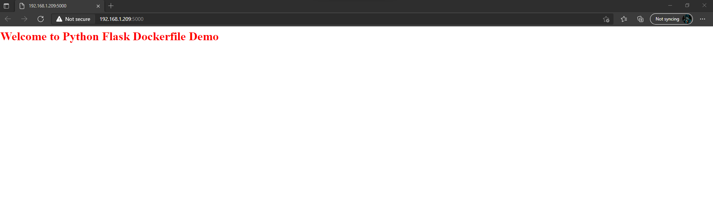

# dockerfile-flask-app-01

This a simple web application developed in python flask web framework, and deployed using docker file.

## procedure to create Flask App

The flask is a micro-web framework of python to build web application and REST API. for creating flask follow the below
steps:

- **Structure flask application directory**
    ```
    📦Dockerfile-flask-app-01
    ┣ 📂app
    ┃ ┣ 📂views
    ┃ ┃ ┃ ┣ 📜baseViews.cpython-310.pyc
    ┃ ┃ ┃ ┗ 📜__init__.cpython-310.pyc
    ┃ ┃ ┣ 📜baseViews.py
    ┃ ┃ ┗ 📜__init__.py
    ┃ ┣ 📂__pycache__
    ┃ ┃ ┗ 📜__init__.cpython-310.pyc
    ┃ ┗ 📜__init__.py
    ┣ 📜.gitignore
    ┣ 📜Dockerfile
    ┣ 📜LICENSE
    ┣ 📜README.md
    ┣ 📜requirements.txt
    ┗ 📜run.py
    ```
  all the required source code is inside this directory structure, so we can review and check it.

## Source Code Overview

```bash
"""
This is a entry point of flask application
"""
from app import app

if __name__ == '__main__':
    app.run(debug=True, host='0.0.0.0', port=5000)

```

---

```bash
""" 
initialize the flask app and views
"""
from app.views import baseViews
from flask import Flask

app = Flask(__name__)

```

---

```bash
"""Create a simple route """
from app import app


@app.route("/")
def index():
    return "Welcome to Flask App!!!"

```

---

## Writting Docker file for the deploy flask application on Docker

* ***What is Dockerfile?*** <br>
  Dockerfile is build image automatiocally using the instruction from file, instruction should be base image, Commands
  and operations. in this example we are going to build flask application using docker.
* Docker file example

  ```bash
  FROM python:3.6 # use base image as python:3.6
  COPY . /app # copy everthing from current directory to app directory.
  WORKDIR /app # make workdir as app
  RUN pip install -r requirements.txt
  ENTRYPOINT ["python"] #python as entrypoint 
  CMD ["run.py"] # run out run.py for start application
  ```
* build dockerfile
    ```bash
    docker build -t flask-app .
    ```
* Checking docker image
  ```bash
  docker images
  REPOSITORY               TAG       IMAGE ID       CREATED       SIZE
  flask-app                latest    4b2446d3d4f9   3 hours ago   940MB
  ```
* Docker run image
  ```bash
  docker run -d -p 5000:5000 flask-app
  ```
once docker image run in detach mode we just need hit the http"//server-ip:5000 <br>

---
For complete source code please clone the repository: <br>
[Dockerfile-flask-app-01](https://github.com/cryptDecoder/dockerfile-flask-app-01.git)